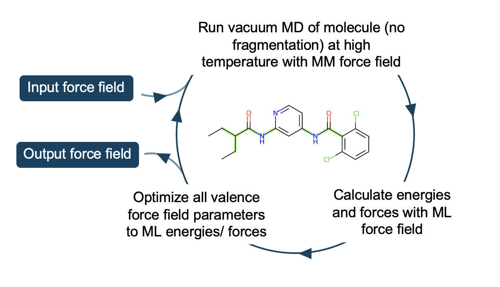

# Method overview

The accuracy of transferable molecular mechanics force fields is often limited by their lack of transferability, rather than their functional form. `presto` aims to generate accurate molecular mechanics force field parameters specifically for your molecule(s) of interest. This is done by fitting parameters to energies and forces from a machine learning potential (MLP) for molecular dynamics configurations for your molecule(s). MLPs often lose little accuracy compared to the QM method they were as trained on (for molecules similar to the training set), but are orders of magnitude faster:

If you are unfamiliar with SMIRNOFF force fields, read **[Bespoke SMIRNOFF in 5 minutes](bespoke-smirnoff-primer.md)** first.

## Initial force field

The fit can be started from any SMIRNOFF force field. Only the valence parameters (bonds, angles, proper torsions, and improper torsions) are trained, while the Lennard-Jones terms and charges are left unaltered. The functional form of the valence terms are:

- Bonds and angles are defined by a harmonic function,
$u(x;k,x_0)=\frac{k}{2}\left(x-x_0\right)^2$,
where the position of the minimum, $x_0$, and the magnitude, $k$, are the fitting parameters.
- Proper and improper torsions are defined by a set of cosine functions,
$u_p(\phi;k,\phi_0)=k\left(1+\cos{\left(p\phi-\phi_0\right)}\right)$,
where the phase, $\phi_0$, and the magnitude, $k$, are the fitted parameters. Here, proper torsions are expanded to include four periodicities, whereas improper torsions include only one. It is also noted that for symmetry, the phase $\phi_0$ is expected to be either 0 or $\pi$

By default, we use the [modified Seminario method (MSM)](https://pubs.acs.org/doi/10.1021/acs.jctc.7b00785) to initialise bonds and angles from the MLP Hessian.

## Bespoke parameter generation

The parameters in an OpenFF SMIRNOFF force field are assigned to specific bonds, angles, etc. using "SMIRKS" (really tagged SMARTS) patterns which are generally very non-specific. By default, we generate extremely specific "SMIRKS" patterns which specify the entire molecule of interest. See **[Type generation and SMIRKS specificity](type-generation.md)** for the options that control this.

!!! info "Stereochemistry handling"
    `presto` bespoke types include no stereochemical information

    This avoids toolkit disagreements between the OpenEye and RDKit toolkits (see [this issue](https://github.com/openforcefield/openff-toolkit/issues/146)) that can otherwise cause type generation failures. The resulting types will match alternative stereoisomers, which should not be an issue for enantiomers unless you are training torsion phase shift (which is not done by default). This may introduce some errors for diastereomers.

## Sampling

The molecule is sampled using high-temperature molecular dynamics. By default, this is performed at 500 K using the input molecular mechanics force field. Well-tempered metadynamics is applied to all rotatable bonds to enhance sampling of diverse conformers and torsional barriers. The sampling is started from several different conformers generated with `RDKit`'s `ETKDG` algorithm. See **[Sampling protocols](sampling-protocols.md)** for the available alternatives.

## Energy and force evaluation

Snapshots are saved from the molecular dynamics and the energies and forces of each are computed using a machine-learning potential (AceFF-2.0 is the historical default, though AIMNet2 is currently used while [an AceFF 2.0 upstream issue](https://github.com/openmm/openmm-ml/issues/137) is resolved). Energies are offset by their mean before training. See **[MLPs in presto](mlps.md)** for guidance on choosing between supported potentials.

## Training

The molecular mechanics force field parameters are optimised to reproduce the energies and forces from the machine learning potential. A regularisation penalty is also applied for deviations of the improper and proper torsion parameters from their starting point. By default, the Adam optimiser is used. A technicality of training is that we linearise the harmonic potentials (bonds and angles) to stabilise fitting — see the footnote.

## Iterations

Optionally, the user can perform iterative fitting, where the molecular mechanics force field (which is used for sampling) is iteratively refined and sampled.

## Final force field

The bespoke parameters are added on to the end of the input force field and this is saved (see `bespoke_ff.offxml` in the relevant output directory, e.g. `training_iteration_2`). Because parameters lower down the `.offxml` file are given higher priority, these parameters are used instead of the original non-specific parameters from the input force field when you parameterise your molecule of interest. See **[Output directory layout](output-layout.md)** for the full file tree.

## Congeneric series fitting

If more than one input molecule is provided, samples will be generated separately for each molecule, but all types will be trained together. If you use the default settings, completely bespoke types will be generated for each molecule, so the result will be the same as running fits for each molecule in parallel. However, by changing the type generation settings (specifically `max_extend_distance`, see **[Type generation and SMIRKS specificity](type-generation.md)**) to generate less specific types, parameters shared between the molecules will be trained together on all of the data.

This also applies when you provide multiple unique molecules in a single SDF file.

For a step-by-step recipe, see the **[Fit a congeneric series](../how-to/fit-congeneric-series.md)** how-to.

---

### Footnote

To stabilise and speed up convergence of the parameter fitting, harmonic potentials are *linearized*.

The linearization of the harmonic terms followed the approach by [espaloma](https://doi.org/10.1039/D2SC02739A), where the minimum is assumed to be within a window given by $x_1$ and $x_2$, such that the fitting parameters may by remapped onto linear terms,

$$k_1=k\frac{x_2-x_0}{x_2-x_1} \quad\text{and}\quad k_2=k\frac{x_0-x_1}{x_2-x_1}$$

These terms give the original parameters via,

$$k=k_1+k_2 \quad\text{and}\quad x_0=\frac{k_1x_1+k_2x_2}{k_1+k_2}$$

Crucially, the gradient along $k_1$ and $k_2$ behaves more reliably and so the parameters minimize faster.
